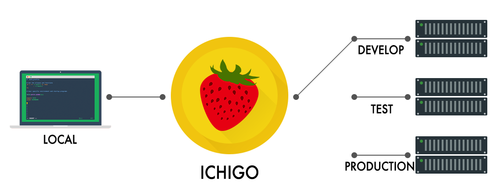

# Ichigo

Reverse proxy for development


## Install

```bash
go get github.com/wacul/ichigo
```

## Usage

```bash
ichigo [-c <file>|--config=<file>]

# Options:
#   -c <file>, --config=<file>    A file contains configurations (YAML). Default: config.yaml
```

## Sample config.yaml

```yaml
addr: :8000
origins: # sources
  - name: back
    endpoints: # destinations
      - key: local
        url: http://127.0.0.1:3000
      - key: develop
        url: http://127.0.0.1:3001
      - key: prerelease
        url: http://127.0.0.1:3002
      - key: production
        url: http://example.com
    endpointKey: local # default endpoint key for "back"
  - name: front
    endpoints: # destinations
      - key: local
        url: http://127.0.0.1:4000
      - key: develop
        url: http://127.0.0.1:4001
      - key: production
        url: http://example.com
    endpointKey: local # default endpoint key for "front"
api:
  pathPrefix: /_proxy
behaviors:
- pathPrefix: /api.v1
  originKey: back
- pathPrefix: /api.v2
  originKey: back
- pathPrefix: /
  originKey: front
```

## Contribution

```sh
npm install gulp
npm install
go generate
```
